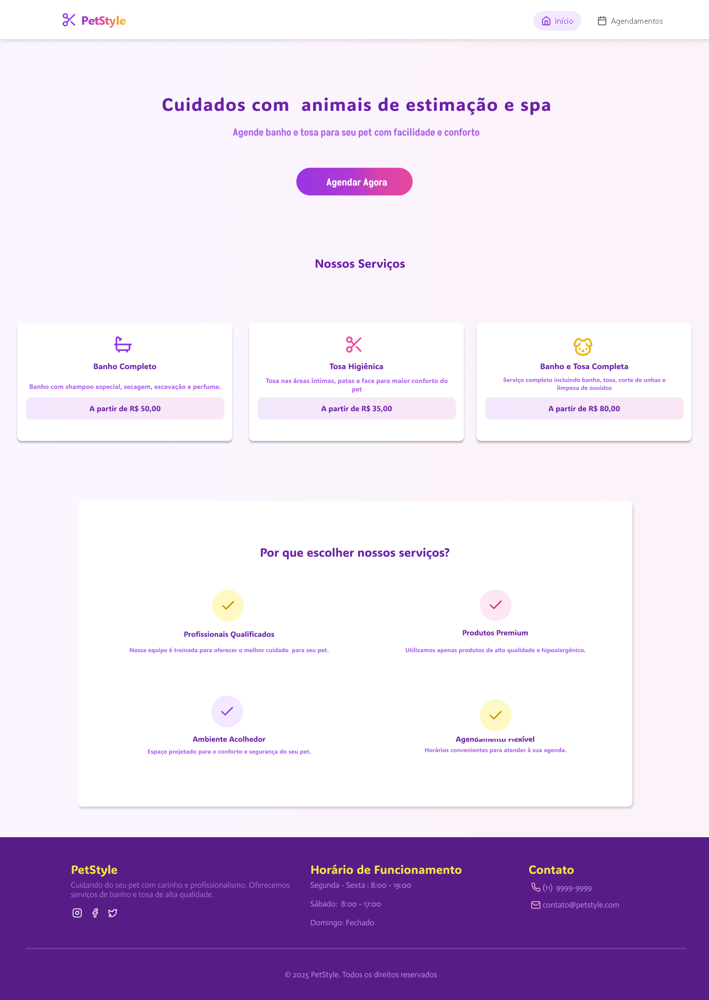
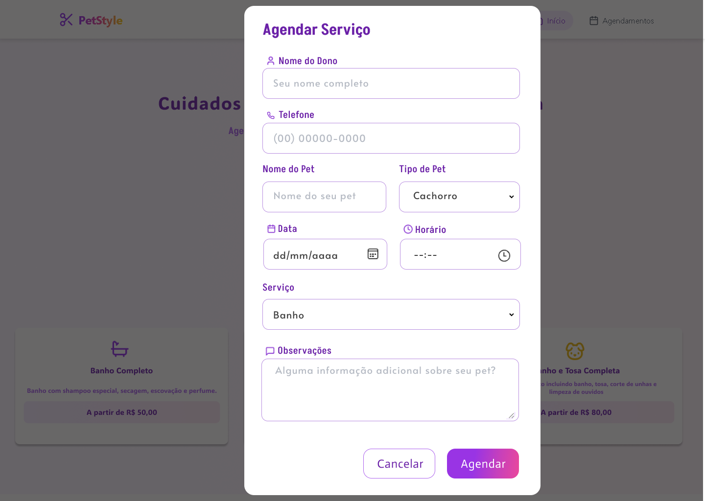

# Projeto de Agendamento de Pet 🐶🐱

Este projeto é um sistema de agendamento de serviços para pets de banho e tosa, utilizando React no frontend e Express no backend.

**Integrantes do Grupo 03**
- Caique Dos Santos Filgueiras
- Daniel Soares
- José Teodoro De Araújo
- Larissa Lima Barreis
- Mariana De Carvalho Fernandes
- Priscila Ramonna da Silva Pires

## 📌Descrição

O sistema permite que os donos de pets agendem serviços para seus animais de estimação. Ele conta com um formulário no frontend onde o usuário insere informações como nome do pet, tipo de serviço e outros detalhes. Essas informações são enviadas para o backend, que gerencia e armazena os agendamentos. O sistema também está integrado com o MongoDB Atlas, permitindo que os agendamentos sejam armazenados e acessados remotamente.

🔐 O projeto segue boas práticas de separação entre frontend e backend, facilitando manutenção e escalabilidade.

📁 Estrutura de pastas organizada para facilitar a navegação e compreensão do código.

## 🚀 Funcionalidades

📅 Cadastro de agendamentos para serviços de pets (banho, tosa, etc.).

👀 Visualização dos agendamentos feitos.

❌ Exclusão de agendamentos.

## Frontend:

⚛️ React – Biblioteca Typescript para construção de interfaces de usuário.

🎨 Tailwind CSS – Framework CSS para estilização rápida e responsiva.

🔤 Lucide React – Conjunto de ícones para React.

## Backend:

🟢 Node.js – Ambiente de execução para JavaScript no backend.

🚀 Express – Framework para criação de servidores web em Node.js.

🔗 CORS – Middleware para permitir requisições de diferentes origens.

📦 Body-Parser – Middleware para analisar o corpo das requisições HTTP.

🌐 MongoDB Atlas – Banco de dados remoto para armazenar os agendamentos.

## 📌 Como Rodar o Projeto: Rodando o Frontend

**Pré-requisitos**

- instalar o npm:  npm install
- depois de intalado: npm run dev

  Vai abrir o projeto em: Local:   http://localhost:5173/

## Rodando o Backend
Abra outro terminal:

 - digitar no terminal: node server.js
   
O backend estará rodando na porta 5000 por padrão.
Você pode acessar as rotas da API em http://localhost:5000.

## 🌐 Endpoints da API

Se estiver utilizando o Insomnia ou Postman, aqui estão os endpoints disponíveis:

GET /appointments: Retorna todos os agendamentos.

POST /appointments: Adiciona um novo agendamento.

PUT /appointments/:id: Edita um agendamento pelo ID.

DELETE /appointments/:id: Exclui um agendamento pelo ID.

## Nosso Site ##
🌐 [Acesse o site](https://Princyrr.github.io/projeto_pet_pIntegrador)

## Telas ##
* Tela principal 

* Tela de Agendamento

* Meus Agendamentos

